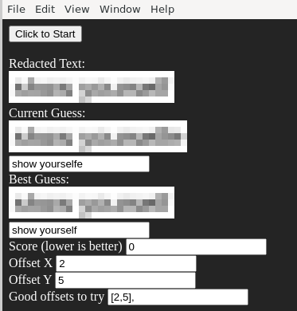

> Author: Solli#0387

## Chall
### Description

    [REDACTED]

    *Wrap the un-redacted text in TG22{}*

### Solution

You can find several tools to unredact text like this. The tool which is supposed to be used was released recently: 

https://github.com/BishopFox/unredacter

Running the program on the input file will give the text:

Wrap flag in TG22{}

Flag: `TG22{show yourself}`
